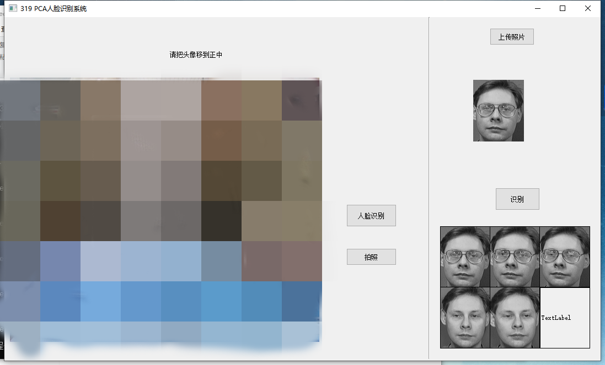

# Simple-PCA

简易的利用PCA降维算法制作的人脸识别系统.可以从图片库中选择人脸图片进行识别，识别的图片会显示在下方，还可以进行在线拍照识别哦~
<br>
给室友做了一个人脸门禁哈哈，可以把室友的照片存入数据库然后进行识别 :smirk:
<br>
人工智能高级的大作业，主要用到PCA降维算法，Pyqt等


<!-- PROJECT LOGO -->
<br />

<p align="center">
  <div>
    
  </div>

  <h3 align="center">系统界面</h3>

</p>

简易的系统刚学不就写的很烂哈哈

 

### 注意

###### 用到的报


1.openv

2.sklearn

3.numpy

4.matplotlib
等


###### **下载链接**

```sh
git clone https://github.com/shaojintian/Best_README_template.git
```

### PCA的学习
推荐的文章
- [人脸识别之主成分分析（PCA）](https://zhuanlan.zhihu.com/p/26652435)
- [PCA人脸识别详解——初学者必看](https://blog.csdn.net/xiaomage_gf/article/details/50510997)
- 

